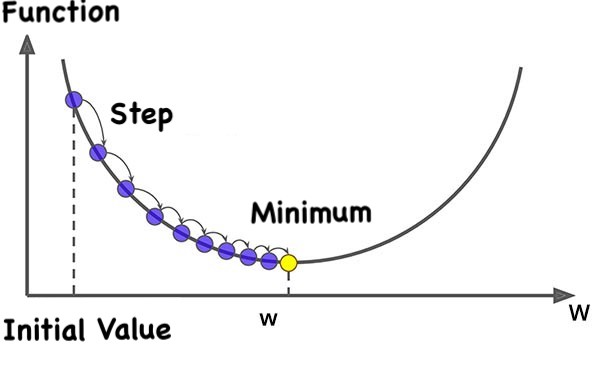

# Advanced Programming - HW6
<p  align="center"> <b>Homework 6 - Spring 2022 Semester <br> Deadline: Thursday khordad 12th - 11:59 pm</b> </p>

## Outline
In this homework, we are going to Solve 4 questions using functions in the C++ STL library. Read each question carefully and write down your code.

</br>

# Question 1
In this question, we want to implement the gradient descent algorithm in an STL way. As you know in gradient descent we aim to find where is the minimum of a function by moving in a way that our function is decreasing, like in the picture below:

<br>
<p align="center">

</p>
<br>

implement a function called `gradient_descent` that calculates the minimum of any given math-function (like sine, cosine, ...). the math-function can be a pointer to function, lambda function or a functor (see tests 1 to 4). The first input of your function should be `the initial value` and the second input `the step size`.

**Note.** implement all your code in `q1` namespace and `q1.h` file.

</br>

# Question 2
In this question, we want to read the `resources/lung_cancer.csv` file and sort the patients by the possibility of whether or not they have lung cancer (in increasing order).
First, implement a struct called `Patient` containing the necessary variables for a patient - something like this:

```cpp
struct Patient
{
	std::string name;
	size_t age;
	size_t smokes;
	size_t area_q;
	size_t alkhol;
};
```

**Note.** store both the first name and last name of the patients in the `name` variable in the above struct like `"John Wick"`.

Then implement the `read_file` function and read the `resources/lung_cancer.csv` content and create a std::vector of the patients.

```cpp
std::vector<Patient> read_file(std::string filename)
```

Finally, implement a function called `sort` and sort the patients by their possibility of having lung cancer. To sort them you have to compare the sum of the variables of each patient with the below weights:

```cpp
3*age + 5*smokes + 2*area_q + 4*alkhol
```
**Note.** you are not allowed to use any `for` in your `sort` function.

**Note.** implement all your code in `q2` namespace and `q2.h` file.

</br> 

# Question 3
In this question, we want to store the flights in the `resources/flights.txt` file, in a `std::priority_queue` container.
Like question2 create a struct for each flight like below:

```cpp
struct Flight
{
	std::string flight_number;
	size_t duration;
	size_t connections;
	size_t connection_times;
	size_t price;
};
```

**Note.** each flight may have one or more connections and therefore connection-times. the variable named `connection_times` is the overall connection time of the flight.

Now implement a function called `gather_flights` and return a priority queue containing all the flights in the file. Your function has one input which is the `filename` i.e. `flights.txt`. To compare the flights you should compare the weighted sum of the properties of each flight with the below weights:

```cpp
duration + connection_times + 3*price
```

**Note.** you are not allowed to use any `for` in your `gather_flights` function.

**Note.** implement all your code in `q3` namespace and `q3.h` file.

</br>

# Question 4
In this question, we want to implement an algorithm called `kalman_filter` (at least a simple version of it).
Kalman filter is used to find the best estimate of a state by combining measurements from various sensors. meaning, sometimes to have a more accurate measurement of a variable you would use multiple sensors instead of just one and calculate the mean of these sensors as your measurement. It is worth mentioning: your sensors do not always have the same accuracy so instead of calculating the pure mean of your sensor, you should calculate the weighted mean of your sensors based on their accuracy.
The sensors we want to use in this question are position sensors that measure the position in a 2D plane.
So, implement the struct below to represent our position sensors. (you can add constructors or other stuff if needed)

```cpp
struct Vector2D
{
double x{};
double y{}; 
};

struct Sensor
{
	Vector2D pos;
	double accuracy;    
};
```

and implement the below function for the kalman-filter:

```cpp
Vector2D kalman_filter(std::vector<Sensor> sensors)
```

this function calculates our final position measurement based on the kalman-filter of `sensors`.

**Note.** again you are not allowed to use any `for` in your `gather_flights` function.

**Note.** implement all your code in `q4` namespace and `q4.h` file.


</br>

# Finally
As mentioned before, do not alter other files already populated except otherwise indicated. In case you want to test your code you may use the `debug` section of the `main.cpp`.

```cpp
if (true) // make false to run unit tests  
{ 
	// debug section 
}  
else  
{  
	::testing::InitGoogleTest(&argc, argv);  
	std::cout << "RUNNING TESTS ..." << std::endl;  
	int ret{RUN_ALL_TESTS()};  
	if (!ret)  
		std::cout << "<<<SUCCESS>>>" << std::endl;  
	else  
	  std::cout << "FAILED" << std::endl;  
}  
return 0;
```
<br/>
<p  align="center"> <b>GOOD LUCK</b> </p>